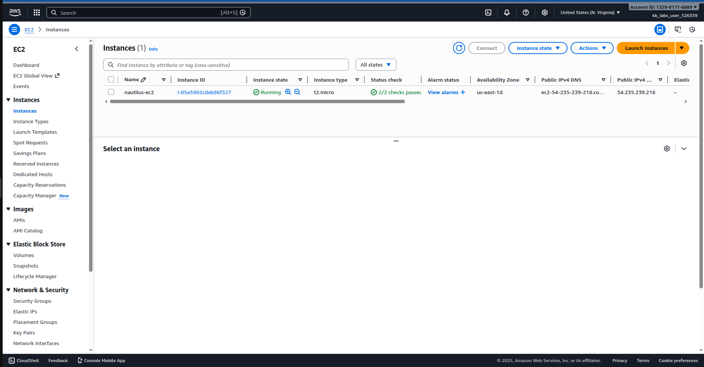
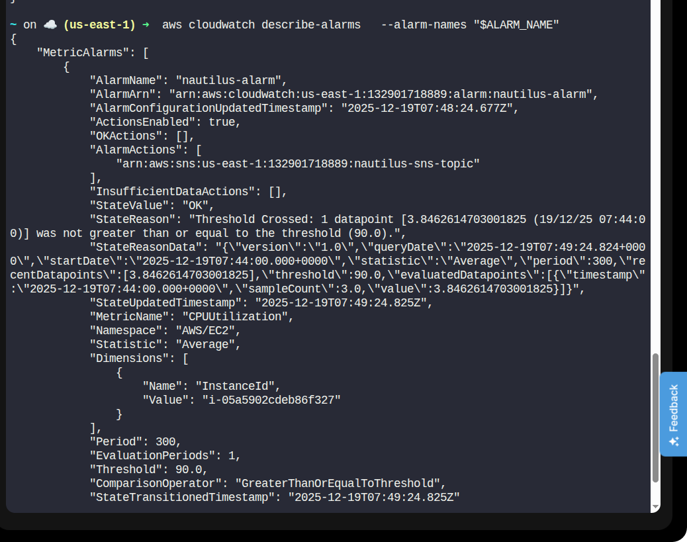

# Day 25 – EC2 CPU Monitoring with CloudWatch Alarm (AWS CLI)

> Keep your face always toward the sunshine, and shadows will fall behind you.
>
> – Walt Whitman

## Task Description

The Nautilus DevOps team needs to provision an EC2 instance for an application and set up monitoring to ensure optimal performance. To achieve this, a CloudWatch alarm must be configured to monitor the instance's CPU utilization.

If the CPU usage exceeds 90% for a continuous 5-minute period, an alert should be triggered and a notification sent via an existing SNS topic.

## Requirements

| Requirement              | Value                      |
|-------------------------|----------------------------|
| EC2 instance name       | `nautilus-ec2`             |
| AMI                     | Ubuntu (any suitable version) |
| Instance type           | `t2.micro`                 |
| CloudWatch alarm name   | `nautilus-alarm`           |
| Metric                  | CPUUtilization             |
| Statistic               | Average                    |
| Threshold               | >= 90%                     |
| Evaluation period       | 1 period of 5 minutes      |
| Alarm action            | Notify SNS topic `nautilus-sns-topic` |
| Region                  | `us-east-1`                |

## Solution (Using AWS CLI)

### Step 1: Set Required Variables

```bash
REGION="us-east-1"
EC2_NAME="nautilus-ec2"
INSTANCE_TYPE="t2.micro"
ALARM_NAME="nautilus-alarm"
SNS_TOPIC_NAME="nautilus-sns-topic"
```

### Step 2: Fetch Latest Ubuntu AMI ID

```bash
AMI_ID=$(aws ec2 describe-images \
  --region "$REGION" \
  --owners 099720109477 \
  --filters "Name=name,Values=ubuntu/images/hvm-ssd/ubuntu-jammy-22.04-amd64-server-*" \
            "Name=state,Values=available" \
  --query "sort_by(Images, &CreationDate)[-1].ImageId" \
  --output text)

echo "Using AMI: $AMI_ID"
```

### Step 3: Launch EC2 Instance

```bash
INSTANCE_ID=$(aws ec2 run-instances \
  --image-id "$AMI_ID" \
  --instance-type "$INSTANCE_TYPE" \
  --tag-specifications "ResourceType=instance,Tags=[{Key=Name,Value=$EC2_NAME}]" \
  --query "Instances[0].InstanceId" \
  --output text)

echo "EC2 Instance ID: $INSTANCE_ID"
```

### Step 4: Wait for EC2 Instance to Reach Running State

```bash
aws ec2 wait instance-running --instance-ids "$INSTANCE_ID"
```
Or you can check on the aws dashboard to see your running instance 

### Step 5: Retrieve SNS Topic ARN

```bash
SNS_TOPIC_ARN=$(aws sns list-topics \
  --query "Topics[?contains(TopicArn, '$SNS_TOPIC_NAME')].TopicArn" \
  --output text)

echo "SNS Topic ARN: $SNS_TOPIC_ARN"
```

### Step 6: Create CloudWatch Alarm

```bash
aws cloudwatch put-metric-alarm \
  --alarm-name "$ALARM_NAME" \
  --metric-name CPUUtilization \
  --namespace AWS/EC2 \
  --statistic Average \
  --period 300 \
  --threshold 90 \
  --comparison-operator GreaterThanOrEqualToThreshold \
  --evaluation-periods 1 \
  --alarm-actions "$SNS_TOPIC_ARN" \
  --dimensions Name=InstanceId,Value="$INSTANCE_ID"
```

### Step 7: Verify Alarm Creation

```bash
aws cloudwatch describe-alarms \
  --alarm-names "$ALARM_NAME"
```


Expected state: `StateValue: OK` if you are not getting anything yet then you should wait like for a minute or 2 and you start getting the metrics

The alarm will move to `ALARM` state only when CPU >= 90%.

## Task Completed

- EC2 instance `nautilus-ec2` launched
- CloudWatch alarm `nautilus-alarm` configured
- Alarm monitors CPU utilization (Average >= 90%)
- SNS topic `nautilus-sns-topic` set as alarm action

