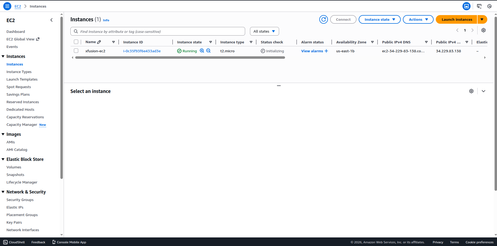
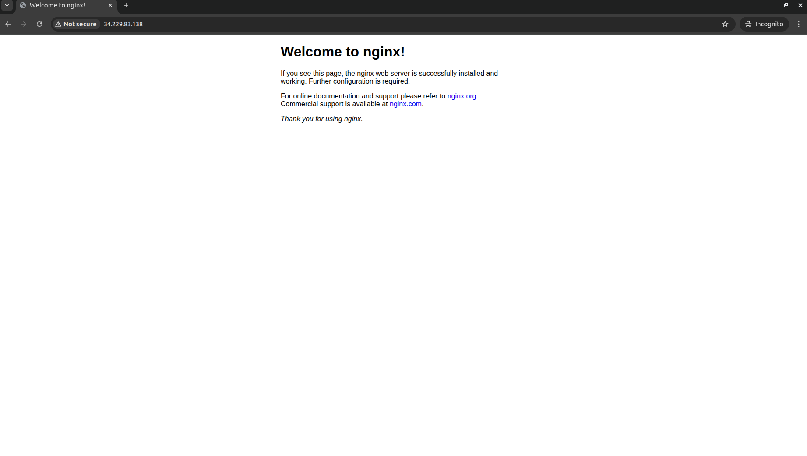

# Day 26 – Launch EC2 Web Server with Nginx (User Data)

> Real difficulties can be overcome; it is only the imaginary ones that are unconquerable.
>
> – Theodore N. Vail

## Task Description

The Nautilus DevOps Team is setting up a new web server for a critical application.
You are required to create an EC2 instance that will act as a web server using Nginx, ensuring it is automatically configured at launch and accessible from the internet.

## Requirements

| Requirement           | Value                                      |
|----------------------|---------------------------------------------|
| Instance Name        | `xfusion-ec2`                               |
| AMI                  | Any Ubuntu AMI                              |
| Instance Type        | `t2.micro`                                  |
| User Data Script     | Install Nginx, Start Nginx service          |
| Security Group       | Allow HTTP traffic on port 80 from anywhere |
| Region               | `us-east-1`                                 |
| Access               | Application must be reachable via browser   |

## Solution (Using AWS CLI)

All commands are executed from the aws-client host.

### Step 1: Set Required Variables

```bash
REGION="us-east-1"
INSTANCE_NAME="xfusion-ec2"
INSTANCE_TYPE="t2.micro"
```

### Step 2: Fetch Latest Ubuntu AMI ID (22.04 LTS)

```bash
AMI_ID=$(aws ec2 describe-images \
  --region $REGION \
  --owners 099720109477 \
  --filters "Name=name,Values=ubuntu/images/hvm-ssd/ubuntu-jammy-22.04-amd64-server-*" \
            "Name=state,Values=available" \
  --query "sort_by(Images, &CreationDate)[-1].ImageId" \
  --output text)

echo "Using AMI: $AMI_ID"
```

### Step 3: Create a Security Group for HTTP Access

```bash
VPC_ID=$(aws ec2 describe-vpcs \
  --filters Name=isDefault,Values=true \
  --query "Vpcs[0].VpcId" \
  --output text)

SG_ID=$(aws ec2 create-security-group \
  --group-name xfusion-web-sg \
  --description "Allow HTTP access" \
  --vpc-id $VPC_ID \
  --query "GroupId" \
  --output text)

echo "Security Group ID: $SG_ID"
```

### Step 4: Allow HTTP Traffic on Port 80

```bash
aws ec2 authorize-security-group-ingress \
  --group-id $SG_ID \
  --protocol tcp \
  --port 80 \
  --cidr 0.0.0.0/0
```

### Step 5: Create User Data Script for Nginx

```bash
cat << 'EOF' > user-data.sh
#!/bin/bash
apt update -y
apt install -y nginx
systemctl start nginx
systemctl enable nginx
EOF
```

### Step 6: Launch the EC2 Instance with User Data

```bash
INSTANCE_ID=$(aws ec2 run-instances \
  --image-id $AMI_ID \
  --instance-type $INSTANCE_TYPE \
  --security-group-ids $SG_ID \
  --user-data file://user-data.sh \
  --tag-specifications "ResourceType=instance,Tags=[{Key=Name,Value=$INSTANCE_NAME}]" \
  --query "Instances[0].InstanceId" \
  --output text)

echo "EC2 Instance ID: $INSTANCE_ID"
```

### Step 7: Wait for Instance to Be Running

```bash
aws ec2 wait instance-running --instance-ids $INSTANCE_ID
```
or visit the dashboard


### Step 8: Get Public IP Address

```bash
PUBLIC_IP=$(aws ec2 describe-instances \
  --instance-ids $INSTANCE_ID \
  --query "Reservations[0].Instances[0].PublicIpAddress" \
  --output text)

echo "Public IP: $PUBLIC_IP"
```

### Step 9: Verify in Browser

Open your browser and visit:

```
http://<PUBLIC_IP>
```

You should see the default Nginx welcome page, confirming:

- User data executed successfully
- Nginx installed and running
- Port 80 is accessible from the internet

