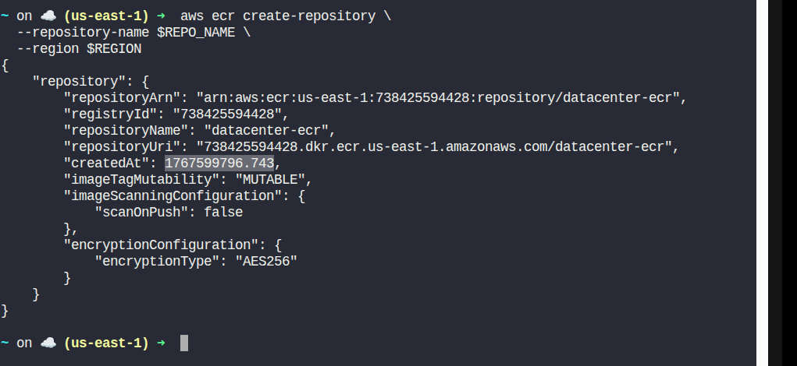
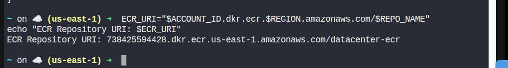
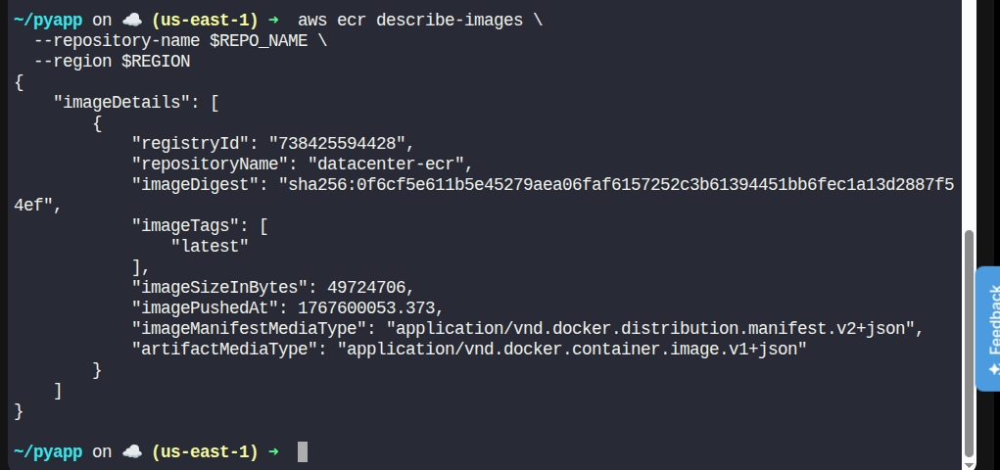

# Day 28 – Create ECR Repository and Push Docker Image

> Two things define you: your patience when you have nothing and your attitude when you have everything.
>
> – George Bernard Shaw

## Task Description

The Nautilus DevOps team is setting up a containerized application workflow.
To support this, they need a private Amazon Elastic Container Registry (ECR) repository to store Docker images.

As part of this task, you must:

- Create a private ECR repository named `datacenter-ecr`
- Build a Docker image using the Dockerfile located at `/root/pyapp` on the aws-client host
- Tag the image as `latest`
- Push the image to the newly created ECR repository

## Requirements

| Requirement        | Value              |
|-------------------|--------------------|
| Region            | `us-east-1`        |
| Repository Type   | Private            |
| Repository Name   | `datacenter-ecr`   |
| Image Tag         | `latest`           |
| Tools             | AWS CLI and Docker |

## Solution (Using AWS CLI & Docker)

All commands below are executed on the aws-client host.

### Step 1: Set Environment Variables

```bash
REGION="us-east-1"
REPO_NAME="datacenter-ecr"
ACCOUNT_ID=$(aws sts get-caller-identity --query Account --output text)
```

### Step 2: Create the Private ECR Repository

```bash
aws ecr create-repository \
  --repository-name $REPO_NAME \
  --region $REGION
```

Expected output includes the repository URI, for example:



### Step 3: Store the ECR Repository URI

```bash
ECR_URI="$ACCOUNT_ID.dkr.ecr.$REGION.amazonaws.com/$REPO_NAME"
echo "ECR Repository URI: $ECR_URI"
```

### Step 4: Authenticate Docker to ECR

```bash
aws ecr get-login-password --region $REGION \
  | docker login \
    --username AWS \
    --password-stdin $ACCOUNT_ID.dkr.ecr.$REGION.amazonaws.com
```

This allows Docker to push images to ECR.

### Step 5: Build Docker Image from Dockerfile

Navigate to the directory containing the Dockerfile:

```bash
cd /root/pyapp
```

Build the Docker image:

```bash
docker build -t datacenter-ecr:latest .
```

### Step 6: Tag the Image for ECR

```bash
docker tag datacenter-ecr:latest $ECR_URI:latest
```

### Step 7: Push the Image to ECR

```bash
docker push $ECR_URI:latest
```

This uploads the Docker image to the private ECR repository.

## Verification Steps

### Verify Repository Exists

```bash
aws ecr describe-repositories \
  --repository-names $REPO_NAME \
  --region $REGION
```

### Verify Image in ECR

```bash
aws ecr describe-images \
  --repository-name $REPO_NAME \
  --region $REGION
```


