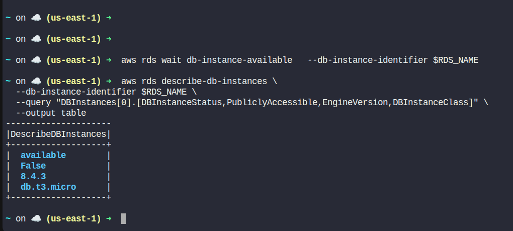

# Day 31 – Configuring a Private RDS Instance for Application Development

> Practice as if you are the worst, Perform as if you are the best.

## Task Description

The Nautilus Development Team is working on a new application feature that requires a reliable and scalable database solution. To facilitate development and testing, they need a new private Amazon RDS instance. This instance will store critical application data and must be provisioned using the AWS Free Tier to minimize costs during the initial development phase.

The team has chosen MySQL as the database engine due to its compatibility with their existing systems. The DevOps team has been tasked with setting up this RDS instance and ensuring that it is properly configured and available for use.

## Objectives

As a member of the Nautilus DevOps Team, perform the following tasks:

**Provision a Private RDS Instance:**
- Instance name: `devops-rds`
- Instance class: `db.t3.micro`
- Use a sandbox-compatible template

**Engine Configuration:**
- Database engine: MySQL
- Engine version: 8.4.x

**Storage Configuration:**
- Enable storage autoscaling
- Set maximum storage threshold to 50 GB
- Keep all other configurations as default

**Instance Availability:**
- Ensure the RDS instance reaches the Available state before submission

## Requirements

| Requirement           | Value                |
|----------------------|----------------------|
| RDS Instance Name    | `nautilus-rds`       |
| Instance Class       | `db.t3.micro`        |
| Engine               | MySQL                |
| Engine Version       | 8.4.x                |
| Max Storage          | 50 GB                |
| Publicly Accessible  | No (Private)         |
| Region               | `us-east-1`          |

## Solution (Using AWS CLI)

### Step 1: Set Variables

```bash
RDS_NAME="nautilus-rds"
INSTANCE_TYPE="db.t3.micro"
ENGINE="mysql"
ENGINE_VERSION="8.4.3"
MAX_STORAGE=50
SUBNET_GROUP="db-subnet-group"
SECURITY_GROUP="rds-sg"
```

### Step 2: Get Default VPC ID

```bash
VPC_ID=$(aws ec2 describe-vpcs \
  --filters Name=isDefault,Values=true \
  --query "Vpcs[0].VpcId" \
  --output text)

echo "Default VPC ID: $VPC_ID"
```

### Step 3: Get Subnets in Default VPC

RDS subnet groups must include at least two subnets in different AZs.

```bash
SUBNET_IDS=$(aws ec2 describe-subnets \
  --filters Name=vpc-id,Values="$VPC_ID" \
  --query "Subnets[*].SubnetId" \
  --output text)

echo "Subnet IDs: $SUBNET_IDS"
```

### Step 4: Create DB Subnet Group

```bash
aws rds create-db-subnet-group \
  --db-subnet-group-name $SUBNET_GROUP \
  --db-subnet-group-description "Subnet group for RDS" \
  --subnet-ids $SUBNET_IDS
```

### Step 5: Create Security Group for RDS

```bash
RDS_SG_ID=$(aws ec2 create-security-group \
  --group-name $SECURITY_GROUP \
  --description "RDS SG" \
  --vpc-id "$VPC_ID" \
  --query "GroupId" \
  --output text)

echo "RDS Security Group ID: $RDS_SG_ID"
```

No inbound rules are required for this lab unless explicitly stated.

### Step 6: Create the Private RDS Instance

```bash
aws rds create-db-instance \
  --db-instance-identifier $RDS_NAME \
  --db-instance-class $INSTANCE_TYPE \
  --engine $ENGINE \
  --engine-version $ENGINE_VERSION \
  --allocated-storage 20 \
  --max-allocated-storage $MAX_STORAGE \
  --master-username admin \
  --master-user-password <your-password> \
  --db-subnet-group-name $SUBNET_GROUP \
  --vpc-security-group-ids "$RDS_SG_ID" \
  --no-publicly-accessible \
  --backup-retention-period 1 \
  --storage-type gp2
```

This command:
- Uses MySQL 8.4.3 (sandbox-supported)
- Enables storage autoscaling
- Creates a private RDS instance
- Uses Free Tier–eligible resources

### Step 7: Wait Until the RDS Instance Is Available

```bash
aws rds wait db-instance-available \
  --db-instance-identifier $RDS_NAME
```

### Step 8: Validate the RDS Instance

```bash
aws rds describe-db-instances \
  --db-instance-identifier $RDS_NAME \
  --query "DBInstances[0].[DBInstanceStatus,PubliclyAccessible,EngineVersion,DBInstanceClass]" \
  --output table
```

### Expected Output



## Task Completed

- Private RDS instance `devops-rds` created
- MySQL 8.4.3 engine configured
- Storage autoscaling enabled (max 50 GB)
- Instance is not publicly accessible
- RDS instance reached Available state

