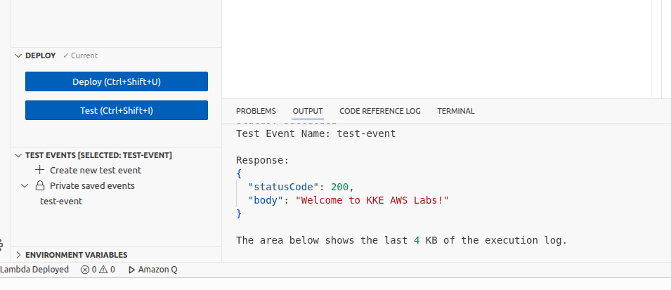

# Day 33 – Creating a Simple AWS Lambda Function (Console-Based)

> There is only one success - to be able to spend your life in your own way.
>
> – Christopher Morley

## Task Description

The Nautilus DevOps team is embracing serverless architecture by integrating AWS Lambda into their operational tasks. To demonstrate the power of serverless computing—such as rapid deployment and easy scalability—the team has decided to deploy a simple AWS Lambda function.

As a member of the Nautilus DevOps Team, your task is to create a Lambda function that returns a custom greeting message. This task must be completed using the AWS Management Console.

## Requirements

| Requirement           | Value                          |
|----------------------|--------------------------------|
| Function Name        | `xfusion-lambda`               |
| Runtime              | Python                         |
| Return Message       | `Welcome to KKE AWS Labs!`     |
| HTTP Status Code     | 200                            |
| IAM Role             | `lambda_execution_role`        |
| Region               | `us-east-1`                    |

## Solution (AWS Console)

### Step 1: Log in to AWS Console

- Open the AWS Console using the provided URL
- Log in with the given credentials
- Confirm the region is set to `us-east-1`

### Step 2: Create IAM Role for Lambda

1. Go to **IAM → Roles**
2. Click **Create role**
3. Select **AWS service**
4. Choose **Lambda**
5. Click **Next**

**Attach Permissions:**

- Select `AWSLambdaBasicExecutionRole`
- Click **Next**

**Role name:**

```
lambda_execution_role
```

Click **Create role**

IAM role successfully created.

### Step 3: Create the Lambda Function

1. Go to **Services → Lambda**
2. Click **Create function**
3. Choose **Author from scratch**

**Basic Settings:**

- Function name: `xfusion-lambda`
- Runtime: Python 3.x
- Architecture: x86_64

**Permissions:**

- Select **Use an existing role**
- Choose: `lambda_execution_role`

Click **Create function**

Lambda function created successfully.

### Step 4: Add Lambda Function Code

In the Code section, replace the default code with the following:

```python
def lambda_handler(event, context):
    return {
        "statusCode": 200,
        "body": "Welcome to KKE AWS Labs!"
    }
```

Click **Deploy**

### Step 5: Test the Lambda Function

1. Click **Test**
2. Choose **Create new event**
3. Event name: `test-event`
4. Keep default JSON
5. Click **Test**

### Expected Output

```json
{
  "statusCode": 200,
  "body": "Welcome to KKE AWS Labs!"
}
```

- Status code is 200
- Message returned correctly


## Task Completed

- IAM role `lambda_execution_role` created with `AWSLambdaBasicExecutionRole` policy
- Lambda function `xfusion-lambda` created with Python runtime
- Function returns the greeting message with HTTP status 200
- Function tested successfully