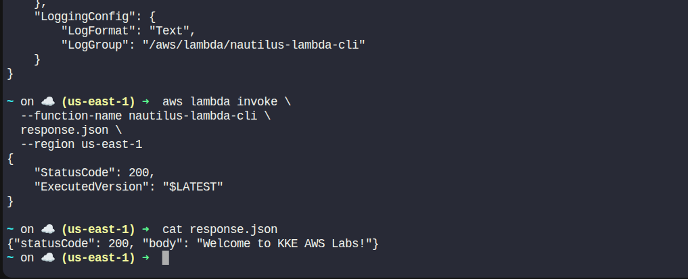

# Day 34 – Creating an AWS Lambda Function Using AWS CLI

> Sometimes things aren't clear right away. That's where you need to be patient and persevere and see where things lead.
>
> – Mary Pierce

## Task Description

The Nautilus DevOps team continues to explore serverless architecture by deploying another AWS Lambda function. Unlike the previous task, this function must be created using the AWS CLI to help the team become comfortable with command-line–based workflows.

The Lambda function will return a simple greeting message and demonstrate how Lambda functions can be deployed using a zipped Python script.

As a member of the Nautilus DevOps Team, your task is to create, package, and deploy a Lambda function using the AWS CLI.

## Requirements

| Requirement           | Value                          |
|----------------------|--------------------------------|
| Python Script        | `lambda_function.py`           |
| Zip File             | `function.zip`                 |
| Function Name        | `nautilus-lambda-cli`          |
| Runtime              | Python                         |
| Return Message       | `Welcome to KKE AWS Labs!`     |
| HTTP Status Code     | 200                            |
| IAM Role             | `lambda_execution_role`        |
| Region               | `us-east-1`                    |

## Solution (Using AWS CLI)

### Step 1: Verify AWS CLI Configuration

```bash
aws sts get-caller-identity
```

Confirms AWS CLI is configured and authenticated.

### Step 2: Create the Python Lambda Script

Create the file:

```bash
vi lambda_function.py
```

Add the following content:

```python
def lambda_handler(event, context):
    return {
        "statusCode": 200,
        "body": "Welcome to KKE AWS Labs!"
    }
```

Save and exit the file.

### Step 3: Zip the Lambda Function

```bash
zip function.zip lambda_function.py
```

Verify the zip file:

```bash
ls
```

Expected output should include:

```
function.zip
lambda_function.py
```

### Step 4: Get IAM Role ARN

Retrieve the ARN of the IAM role:

```bash
ROLE_ARN=$(aws iam get-role \
  --role-name lambda_execution_role \
  --query "Role.Arn" \
  --output text)

echo $ROLE_ARN
```

### Step 5: Create the Lambda Function

Run the following command to create the Lambda function:

```bash
aws lambda create-function \
  --function-name nautilus-lambda-cli \
  --runtime python3.9 \
  --role $ROLE_ARN \
  --handler lambda_function.lambda_handler \
  --zip-file fileb://function.zip \
  --region us-east-1
```

Lambda function created successfully.

### Step 6: Test the Lambda Function

Invoke the function using AWS CLI:

```bash
aws lambda invoke \
  --function-name nautilus-lambda-cli \
  response.json \
  --region us-east-1
```

View the response:

```bash
cat response.json
```

### Expected Output

```json
{
  "statusCode": 200,
  "body": "Welcome to KKE AWS Labs!"
}
```

- Status code is 200
- Correct message returned



