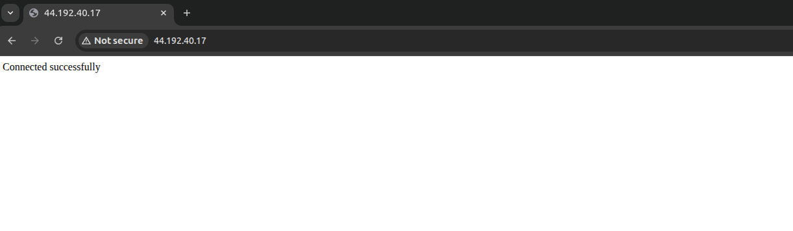

# Day 35 – Deploying and Connecting a Private RDS Instance with EC2

> Excellence happens not by accident. It is a process.
>
> – Dr. APJ. Abdul Kalam

## Task Description

The Nautilus DevOps team needs a new private RDS instance for their application. They need to set up a MySQL database and ensure that their existing EC2 instance can connect to it. This will help in managing their database needs efficiently and securely.

### 1) Task Details

- Create a private RDS instance named `datacenter-rds` using a sandbox template
- The engine type must be MySQL v8.4.5, and it must be a `db.t3.micro` type instance
- The master username must be `datacenter_admin` with an appropriate password
- The RDS storage type must be `gp2`, and the storage size must be 5GiB
- Create a database named `datacenter_db`
- Keep the rest of the configurations as default
- Ensure the instance is in available state
- Adjust the security groups so that the `datacenter-ec2` instance can connect to the RDS on port 3306 and also open port 80 for the instance

### 2) EC2 Access

- An EC2 instance named `datacenter-ec2` exists
- Connect to this instance from the AWS Console
- Create an SSH key (`/root/.ssh/id_rsa`) on the aws-client host if it does not already exist
- Add the public key to the authorized keys of the root user on the EC2 instance for password-less SSH access

### 3) Application Setup

- A file named `index.php` exists under `/root` on the aws-client host
- Copy this file to `/var/www/html/` on the `datacenter-ec2` instance
- Update the file to connect to the RDS instance

### 4) Verification

- Access the EC2 instance using its public IP
- You should see "Connected successfully" in the browser

## Requirements

| Requirement           | Value                    |
|----------------------|--------------------------|
| RDS Instance Name    | `datacenter-rds`         |
| Engine               | MySQL 8.4.5              |
| Instance Class       | `db.t3.micro`            |
| Storage              | 5 GiB, gp2               |
| Master Username      | `datacenter_admin`       |
| Database Name        | `datacenter_db`          |
| EC2 Instance         | `datacenter-ec2`         |
| Region               | `us-east-1`              |

## Solution (Using AWS CLI)

### Step 1: Set Environment Variables

```bash
REGION="us-east-1"

RDS_NAME="datacenter-rds"
ENGINE="mysql"
ENGINE_VERSION="8.4.5"
DB_INSTANCE_CLASS="db.t3.micro"
DB_STORAGE=5
DB_STORAGE_TYPE="gp2"
DB_USER="datacenter_admin"
DB_PASSWORD="<your-password>"
DB_NAME="datacenter_db"

DB_SUBNET_GROUP="datacenter-db-subnet-group"
RDS_SG_NAME="datacenter-rds-sg"
EC2_NAME="datacenter-ec2"
```

### Step 2: Get Default VPC and Subnets

```bash
VPC_ID=$(aws ec2 describe-vpcs \
  --filters Name=isDefault,Values=true \
  --query "Vpcs[0].VpcId" \
  --output text)
```

Get subnet IDs (RDS requires at least two subnets):

```bash
SUBNET_IDS=$(aws ec2 describe-subnets \
  --filters Name=vpc-id,Values="$VPC_ID" \
  --query "Subnets[*].SubnetId" \
  --output text)
```

### Step 3: Create DB Subnet Group

```bash
aws rds create-db-subnet-group \
  --db-subnet-group-name "$DB_SUBNET_GROUP" \
  --db-subnet-group-description "Subnet group for datacenter RDS" \
  --subnet-ids $SUBNET_IDS \
  --region $REGION
```

### Step 4: Create Security Group for RDS

```bash
RDS_SG_ID=$(aws ec2 create-security-group \
  --group-name "$RDS_SG_NAME" \
  --description "RDS access from datacenter EC2" \
  --vpc-id "$VPC_ID" \
  --query "GroupId" \
  --output text)
```

### Step 5: Create the RDS Instance

```bash
aws rds create-db-instance \
  --db-instance-identifier "$RDS_NAME" \
  --engine "$ENGINE" \
  --engine-version "$ENGINE_VERSION" \
  --db-instance-class "$DB_INSTANCE_CLASS" \
  --allocated-storage "$DB_STORAGE" \
  --storage-type "$DB_STORAGE_TYPE" \
  --master-username "$DB_USER" \
  --master-user-password "$DB_PASSWORD" \
  --db-name "$DB_NAME" \
  --db-subnet-group-name "$DB_SUBNET_GROUP" \
  --vpc-security-group-ids "$RDS_SG_ID" \
  --no-publicly-accessible \
  --region "$REGION"
```

Wait until the instance is available:

```bash
aws rds wait db-instance-available \
  --db-instance-identifier "$RDS_NAME" \
  --region "$REGION"
```

### Step 6: Configure Security Groups

**Get EC2 Instance and Security Group:**

```bash
EC2_ID=$(aws ec2 describe-instances \
  --filters Name=tag:Name,Values="$EC2_NAME" \
  --query "Reservations[0].Instances[0].InstanceId" \
  --output text)

EC2_SG_ID=$(aws ec2 describe-instances \
  --instance-ids "$EC2_ID" \
  --query "Reservations[0].Instances[0].SecurityGroups[0].GroupId" \
  --output text)
```

**Allow EC2 → RDS (MySQL):**

```bash
aws ec2 authorize-security-group-ingress \
  --group-id "$RDS_SG_ID" \
  --protocol tcp \
  --port 3306 \
  --source-group "$EC2_SG_ID"
```

**Allow HTTP (80) and SSH (22) on EC2:**

```bash
aws ec2 authorize-security-group-ingress \
  --group-id "$EC2_SG_ID" \
  --protocol tcp \
  --port 80 \
  --cidr 0.0.0.0/0

aws ec2 authorize-security-group-ingress \
  --group-id "$EC2_SG_ID" \
  --protocol tcp \
  --port 22 \
  --cidr 0.0.0.0/0
```

### Step 7: SSH Key Setup (Password-less Access)

**On aws-client host:**

Generate SSH key if missing:

```bash
ssh-keygen -t rsa -b 2048 -f /root/.ssh/id_rsa -N ""
```

Display public key:

```bash
cat /root/.ssh/id_rsa.pub
```

**On EC2 (via AWS Console → EC2 Instance Connect):**

Switch to root:

```bash
sudo su -
```

Create SSH directory and permissions:

```bash
mkdir -p /root/.ssh
chmod 700 /root/.ssh
```

Paste the public key into:

```bash
vi /root/.ssh/authorized_keys
```

Fix permissions:

```bash
chmod 600 /root/.ssh/authorized_keys
chown root:root /root/.ssh/authorized_keys
```

### Step 8: Copy index.php to EC2

Get EC2 public IP:

```bash
EC2_PUBLIC_IP=$(aws ec2 describe-instances \
  --instance-ids "$EC2_ID" \
  --query "Reservations[0].Instances[0].PublicIpAddress" \
  --output text)
```

Copy the file:

```bash
scp /root/index.php root@$EC2_PUBLIC_IP:/var/www/html/index.php
```

### Step 9: Update index.php with RDS Details

Get RDS endpoint:

```bash
RDS_ENDPOINT=$(aws rds describe-db-instances \
  --db-instance-identifier "$RDS_NAME" \
  --query "DBInstances[0].Endpoint.Address" \
  --output text)
```

Edit `/var/www/html/index.php` on EC2:

```php
$dbhost = "<RDS_ENDPOINT>";
$dbname = "datacenter_db";
$dbuser = "datacenter_admin";
$dbpass = "<your-password>";
```

### Step 10: Apache Configuration

On EC2:

```bash
rm -f /var/www/html/index.html
systemctl restart apache2 || systemctl restart httpd
```

### Step 11: Verification

Open a browser:

```
http://<EC2_PUBLIC_IP>
```

You should see: `Connected successfully`



