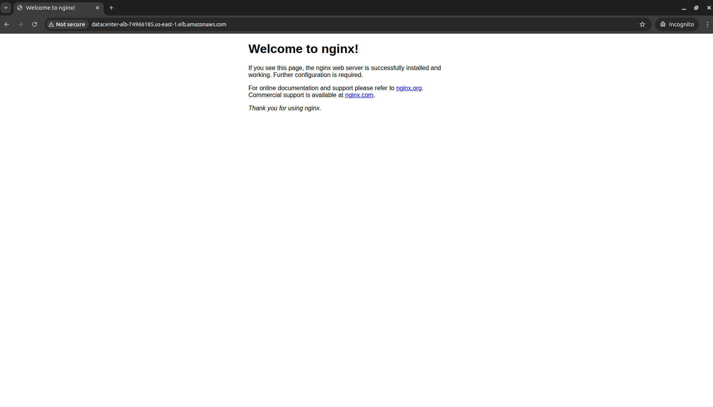

# Day 36 – EC2 + Nginx Behind ALB (AWS CLI Only)

> The more that you read, the more things you will know. The more that you learn, the more places you'll go.
>
> – Dr. Seuss

## Task Description

The Nautilus Development Team needs to set up a new EC2 instance and configure it to run a web server. This EC2 instance should be part of an Application Load Balancer (ALB) setup to ensure high availability and better traffic management. The task involves creating an EC2 instance, setting up an ALB, configuring a target group, and ensuring the web server is accessible via the ALB DNS.

## High-Level Architecture

```
Internet
   |
Application Load Balancer (datacenter-alb)
   |
Target Group (datacenter-tg)
   |
EC2 Instance (datacenter-ec2)
   |
Nginx (port 80)
```

## Requirements

| Requirement           | Value                    |
|----------------------|--------------------------|
| Region               | `us-east-1`              |
| EC2 Instance Name    | `datacenter-ec2`         |
| Security Group       | `datacenter-sg`          |
| ALB Name             | `datacenter-alb`         |
| Target Group Name    | `datacenter-tg`          |
| Target Type          | instance                 |
| Listener             | HTTP :80 → Target Group :80 |
| ALB Security Group   | default                  |

## Solution (Using AWS CLI)

### Step 1: Define Variables

```bash
REGION="us-east-1"

EC2_NAME="datacenter-ec2"
SG_NAME="datacenter-sg"

ALB_NAME="datacenter-alb"
TG_NAME="datacenter-tg"

USER_DATA="/tmp/nginx-user-data.sh"
```

### Step 2: Get Default VPC and Subnets

```bash
VPC_ID=$(aws ec2 describe-vpcs \
  --filters Name=isDefault,Values=true \
  --query "Vpcs[0].VpcId" \
  --output text \
  --region $REGION)

SUBNETS=$(aws ec2 describe-subnets \
  --filters Name=vpc-id,Values=$VPC_ID \
  --query "Subnets[*].SubnetId" \
  --output text \
  --region $REGION)

echo "VPC: $VPC_ID"
echo "Subnets: $SUBNETS"
```

### Step 3: Create Security Group (datacenter-sg)

This SG is attached to EC2, not the ALB.

```bash
SG_ID=$(aws ec2 create-security-group \
  --group-name $SG_NAME \
  --description "Allow HTTP for EC2" \
  --vpc-id $VPC_ID \
  --query "GroupId" \
  --output text \
  --region $REGION)

# Allow HTTP
aws ec2 authorize-security-group-ingress \
  --group-id $SG_ID \
  --protocol tcp \
  --port 80 \
  --cidr 0.0.0.0/0 \
  --region $REGION

echo "Created SG: $SG_ID"
```

### Step 4: Create EC2 User-Data Script

```bash
cat <<EOF > $USER_DATA
#!/bin/bash
apt update -y
apt install -y nginx
systemctl enable nginx
systemctl start nginx
EOF
```

### Step 5: Find Ubuntu AMI

```bash
AMI_ID=$(aws ec2 describe-images \
  --owners 099720109477 \
  --filters "Name=name,Values=ubuntu/images/hvm-ssd/ubuntu-focal-20.04-amd64-server-*" \
           "Name=state,Values=available" \
  --query "Images | sort_by(@,&CreationDate)[-1].ImageId" \
  --output text \
  --region $REGION)

echo "Ubuntu AMI: $AMI_ID"
```

### Step 6: Launch EC2 Instance

```bash
INSTANCE_ID=$(aws ec2 run-instances \
  --image-id $AMI_ID \
  --instance-type t3.micro \
  --subnet-id $(echo $SUBNETS | awk '{print $1}') \
  --security-group-ids $SG_ID \
  --user-data file://$USER_DATA \
  --tag-specifications "ResourceType=instance,Tags=[{Key=Name,Value=$EC2_NAME}]" \
  --query "Instances[0].InstanceId" \
  --output text \
  --region $REGION)

echo "EC2 launched: $INSTANCE_ID"

aws ec2 wait instance-running \
  --instance-ids $INSTANCE_ID \
  --region $REGION
```

### Step 7: Create Target Group

Important: Target type must be `instance` to avoid 503 errors.

```bash
TG_ARN=$(aws elbv2 create-target-group \
  --name $TG_NAME \
  --protocol HTTP \
  --port 80 \
  --vpc-id $VPC_ID \
  --target-type instance \
  --health-check-path "/" \
  --query "TargetGroups[0].TargetGroupArn" \
  --output text \
  --region $REGION)

echo "Target Group ARN: $TG_ARN"
```

### Step 8: Register EC2 with Target Group

```bash
aws elbv2 register-targets \
  --target-group-arn $TG_ARN \
  --targets Id=$INSTANCE_ID \
  --region $REGION
```

### Step 9: Get Default Security Group (for ALB)

```bash
DEFAULT_SG=$(aws ec2 describe-security-groups \
  --filters Name=vpc-id,Values=$VPC_ID Name=group-name,Values=default \
  --query "SecurityGroups[0].GroupId" \
  --output text \
  --region $REGION)
```

Allow HTTP on ALB SG:

```bash
aws ec2 authorize-security-group-ingress \
  --group-id $DEFAULT_SG \
  --protocol tcp \
  --port 80 \
  --cidr 0.0.0.0/0 \
  --region $REGION
```

### Step 10: Create Application Load Balancer

```bash
ALB_ARN=$(aws elbv2 create-load-balancer \
  --name $ALB_NAME \
  --subnets $SUBNETS \
  --security-groups $DEFAULT_SG \
  --scheme internet-facing \
  --type application \
  --query "LoadBalancers[0].LoadBalancerArn" \
  --output text \
  --region $REGION)

ALB_DNS=$(aws elbv2 describe-load-balancers \
  --load-balancer-arns $ALB_ARN \
  --query "LoadBalancers[0].DNSName" \
  --output text \
  --region $REGION)

echo "ALB DNS: $ALB_DNS"
```

### Step 11: Create Listener (Critical Step)

Without this step, you will get 503 errors.

```bash
aws elbv2 create-listener \
  --load-balancer-arn $ALB_ARN \
  --protocol HTTP \
  --port 80 \
  --default-actions Type=forward,TargetGroupArn=$TG_ARN \
  --region $REGION
```

### Step 12: Verify Target Health

```bash
aws elbv2 describe-target-health \
  --target-group-arn $TG_ARN \
  --region $REGION
```

Expected: `State: healthy`

## Final Verification

Open in browser:

