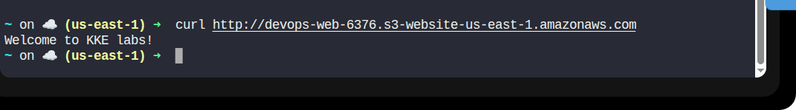

# Day 39 – Hosting a Static Website on AWS S3

> You teach best what you most need to learn.
>
> – Richard Bach

## Task Description

The Nautilus DevOps team has been tasked with creating an internal information portal for public access. As part of this project, they need to host a static website on AWS using an S3 bucket. The S3 bucket must be configured for public access to allow external users to access the static website directly via the S3 website URL.

## Requirements

| Requirement              | Value                      |
|-------------------------|----------------------------|
| Region                  | `us-east-1`                |
| S3 Bucket Name          | `nautilus-web-11606`       |
| Index Document          | `index.html`               |
| Source File Location    | `/root/index.html`         |
| Access                  | Public                     |

## Solution (Using AWS CLI)

### Step 1: Define Environment Variables

```bash
REGION="us-east-1"
BUCKET_NAME="devops-web-6376"
```

### Step 2: Create the S3 Bucket

```bash
aws s3api create-bucket \
  --bucket $BUCKET_NAME \
  --region $REGION
```

### Step 3: Disable Block Public Access

```bash
aws s3api put-public-access-block \
  --bucket $BUCKET_NAME \
  --public-access-block-configuration \
  BlockPublicAcls=false,IgnorePublicAcls=false,BlockPublicPolicy=false,RestrictPublicBuckets=false
```

### Step 4: Configure Static Website Hosting

```bash
aws s3 website s3://$BUCKET_NAME/ \
  --index-document index.html
```

### Step 5: Create Bucket Policy for Public Access

```bash
cat > bucket-policy.json <<EOF
{
  "Version": "2012-10-17",
  "Statement": [
    {
      "Sid": "PublicReadGetObject",
      "Effect": "Allow",
      "Principal": "*",
      "Action": "s3:GetObject",
      "Resource": "arn:aws:s3:::$BUCKET_NAME/*"
    }
  ]
}
EOF
```

Apply the policy:

```bash
aws s3api put-bucket-policy \
  --bucket $BUCKET_NAME \
  --policy file://bucket-policy.json
```

### Step 6: Upload the index.html File

```bash
aws s3 cp /root/index.html s3://$BUCKET_NAME/
```

Verify upload:

```bash
aws s3 ls s3://$BUCKET_NAME/
```

### Step 7: Get the Website URL

```bash
echo "Website URL: http://$BUCKET_NAME.s3-website-$REGION.amazonaws.com"
```

### Step 8: Verify Website Access

```bash
curl http://$BUCKET_NAME.s3-website-$REGION.amazonaws.com
```

Or open in browser:

```
http://devops-web-6376.s3-website-us-east-1.amazonaws.com
```


