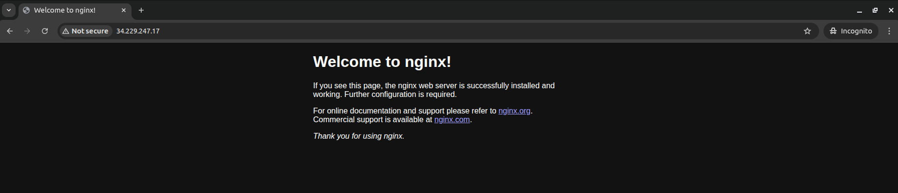

# Day 40 – Troubleshooting EC2 Internet Accessibility (VPC Configuration)

> Excellence happens not by accident. It is a process.
>
> – Dr. APJ. Abdul Kalam

> IT'S THE will, NOT THE skill.
>
> – Jim Bunney

## Task Description

The Nautilus Development Team recently deployed a new web application hosted on an EC2 instance within a public VPC named `xfusion-vpc`. The application, running on an Nginx server, should be accessible from the internet on port 80. Despite configuring the security group `xfusion-sg` to allow traffic on port 80 and verifying the EC2 instance settings, the application remains inaccessible from the internet. The team suspects that the issue might be related to the VPC configuration, as all other components appear to be set up correctly. The DevOps team has been asked to troubleshoot and resolve the issue to ensure the application is accessible to external users.

As a member of the Nautilus DevOps Team, your task is to perform the following:

- **Verify VPC Configuration:** Ensure that the VPC `xfusion-vpc` is properly configured to allow internet access.
- **Ensure Accessibility:** Make sure the EC2 instance `xfusion-ec2` running the Nginx server is accessible from the internet on port 80.

## Requirements

| Requirement           | Value                |
|----------------------|----------------------|
| Region               | `us-east-1`          |
| VPC Name             | `xfusion-vpc`        |
| EC2 Instance Name    | `xfusion-ec2`        |
| Security Group Name  | `xfusion-sg`         |
| Application          | Nginx                |
| Port                 | 80                   |

## Solution (Troubleshooting Steps)

### Step 1: Verify Security Group Configuration (xfusion-sg)

Even though the task says it is configured, we verify first.

Check inbound rules. Ensure `xfusion-sg` has:

| Type | Protocol | Port | Source      |
|------|----------|------|-------------|
| HTTP | TCP      | 80   | 0.0.0.0/0   |

Also ensure SSH (22) exists so we can troubleshoot Nginx if needed:

| Type | Protocol | Port | Source      |
|------|----------|------|-------------|
| SSH  | TCP      | 22   | 0.0.0.0/0   |

If missing, add the rule.

### Step 2: Verify Internet Gateway for xfusion-vpc

A VPC cannot reach the internet without an Internet Gateway, even if it is called "public".

**Check if an Internet Gateway is attached:**

1. Go to VPC → Internet Gateways
2. Confirm an IGW is attached to `xfusion-vpc`

**If NOT attached:**

1. Create an Internet Gateway
2. Attach it to `xfusion-vpc`

This is the most common root cause.

### Step 3: Verify Route Table Configuration (Critical)

Even with an Internet Gateway, traffic will fail if routing is missing.

**Check the route table associated with the EC2 subnet:**

Ensure it contains:

| Destination   | Target                        |
|---------------|-------------------------------|
| 0.0.0.0/0     | Internet Gateway (igw-xxxx)   |

**If missing, add the route:**

- Destination: `0.0.0.0/0`
- Target: Internet Gateway attached to `xfusion-vpc`

Without this, the subnet is private, not public.

### Step 4: Verify Public IP on xfusion-ec2

**Check EC2 instance networking:**

Ensure `xfusion-ec2` has a Public IPv4 address assigned.

**If missing:**

1. Stop the instance
2. Start it again (or enable Auto-assign public IPv4 on the subnet)

### Step 5: Verify Nginx is Running

If networking is correct and it still fails, check the service.

```bash
sudo systemctl status nginx
```

If not running:

```bash
sudo systemctl start nginx
sudo systemctl enable nginx
```

### Step 6: Verify External Access

Using the public IP of `xfusion-ec2`:

```
http://<PUBLIC_IP>
```

If the Nginx welcome page appears, the issue is resolved.


## Task Completed

- Security group `xfusion-sg` verified with HTTP (80) and SSH (22) inbound rules
- Internet Gateway attached to `xfusion-vpc`
- Route table configured with `0.0.0.0/0` route to Internet Gateway
- Public IPv4 address assigned to `xfusion-ec2`
- Nginx service running on the EC2 instance
- Application accessible from the internet on port 80

