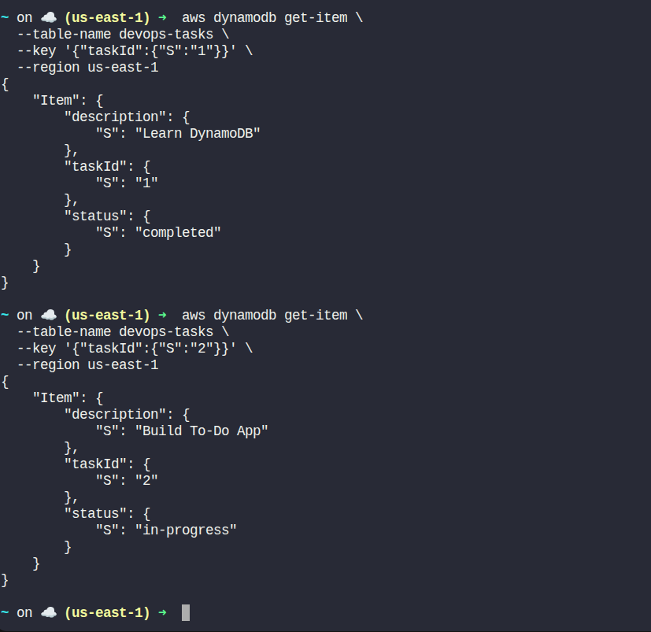

# Day 42 – DynamoDB To-Do Application (AWS CLI)

> Real difficulties can be overcome; it is only the imaginary ones that are unconquerable.
>
> – Theodore N. Vail

## Task Description

The Nautilus DevOps team is developing a simple 'To-Do' application using DynamoDB to store and manage tasks efficiently. The team needs to create a DynamoDB table to hold tasks, each identified by a unique task ID. Each task will have a description and a status, which indicates the progress of the task (e.g., completed or in-progress).

Your task is to:

- Create a DynamoDB table named `devops-tasks` with a primary key called `taskId` (string).
- Insert two tasks into the table:
	- Task 1: `taskId`: `1`, `description`: `Learn DynamoDB`, `status`: `completed`
	- Task 2: `taskId`: `2`, `description`: `Build To-Do App`, `status`: `in-progress`
- Verify Task 1 has status `completed` and Task 2 has status `in-progress`.

## Requirements

| Requirement | Value |
|---|---|
| Region | `us-east-1` |
| Table Name | `devops-tasks` |
| Primary Key | `taskId` (String) |

## Solution (Validator-Safe)

### Step 2: Create the DynamoDB table

```bash
aws dynamodb create-table \
	--table-name devops-tasks \
	--attribute-definitions \
		AttributeName=taskId,AttributeType=S \
	--key-schema \
		AttributeName=taskId,KeyType=HASH \
	--billing-mode PAY_PER_REQUEST \
	--region us-east-1
```

This uses on-demand billing (no capacity provisioning required).

### Step 3: Wait until the table becomes ACTIVE

```bash
aws dynamodb wait table-exists \
	--table-name devops-tasks \
	--region us-east-1
```

### Step 4: Insert Task 1

```bash
aws dynamodb put-item \
	--table-name devops-tasks \
	--item '{
		"taskId": {"S": "1"},
		"description": {"S": "Learn DynamoDB"},
		"status": {"S": "completed"}
	}' \
	--region us-east-1
```

### Step 5: Insert Task 2

```bash
aws dynamodb put-item \
	--table-name devops-tasks \
	--item '{
		"taskId": {"S": "2"},
		"description": {"S": "Build To-Do App"},
		"status": {"S": "in-progress"}
	}' \
	--region us-east-1
```

### Step 6: Verify Task 1

```bash
aws dynamodb get-item \
	--table-name devops-tasks \
	--key '{"taskId":{"S":"1"}}' \
	--region us-east-1
```

Expected output includes:

```
"status": { "S": "completed" }
```

### Step 7: Verify Task 2

```bash
aws dynamodb get-item \
	--table-name devops-tasks \
	--key '{"taskId":{"S":"2"}}' \
	--region us-east-1
```

Expected output includes:

```
"status": { "S": "in-progress" }
```




