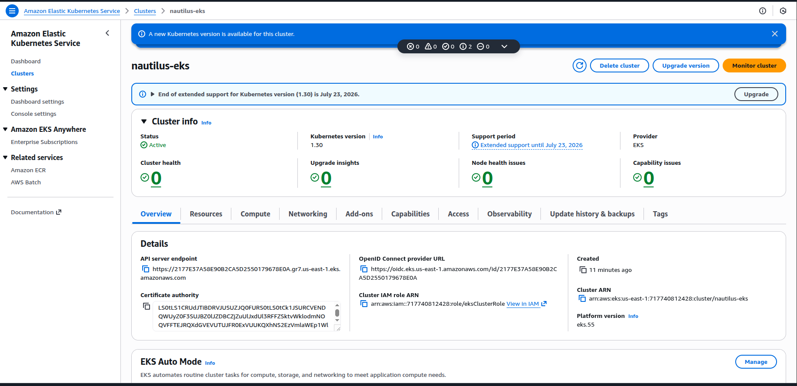

# Day 43 – EKS Cluster with Private Endpoint

> All you need is the plan, the road map, and the courage to press on to your destination.
>
> – Earl Nightingale

## Task Description

The Nautilus DevOps team has been tasked with preparing the infrastructure for a new Kubernetes-based application that will be deployed using Amazon EKS. The team is in the process of setting up an EKS cluster that meets their internal security and scalability standards. They require that the cluster be provisioned using the latest stable Kubernetes version to take advantage of new features and security improvements.

To minimize external exposure, the EKS cluster endpoint must be kept private. Additionally, the cluster needs to use the default VPC with availability zones a, b, and c to ensure high availability across different physical locations.

Your task is to create an EKS cluster named `nautilus-eks`, along with an IAM role for the cluster named `eksClusterRole`. The Kubernetes version must be `1.30`. Ensure that the cluster endpoint access is configured as private.

Finally, verify that the EKS cluster is successfully created with the correct configuration and is ready for workloads.

## Requirements

| Requirement | Value |
|---|---|
| Region | `us-east-1` |
| Cluster Name | `nautilus-eks` |
| IAM Role | `eksClusterRole` |
| Kubernetes Version | `1.30` |
| Endpoint Access | Private (endpointPublicAccess=false, endpointPrivateAccess=true) |
| VPC | Default VPC (AZs: us-east-1a, us-east-1b, us-east-1c) |

## Solution (Using AWS CLI)

### Step 1: Create IAM Role for EKS Cluster

Create a trust policy file `eks-trust-policy.json`:

```json
{
	"Version": "2012-10-17",
	"Statement": [
		{
			"Effect": "Allow",
			"Principal": {
				"Service": "eks.amazonaws.com"
			},
			"Action": "sts:AssumeRole"
		}
	]
}
```

Create the IAM role and attach the required policy:

```bash
aws iam create-role \
	--role-name eksClusterRole \
	--assume-role-policy-document file://eks-trust-policy.json \
	--region us-east-1

aws iam attach-role-policy \
	--role-name eksClusterRole \
	--policy-arn arn:aws:iam::aws:policy/AmazonEKSClusterPolicy \
	--region us-east-1
```

### Step 2: Fetch Default VPC Subnets (AZ a, b, c)

Retrieve subnet IDs from the default VPC in availability zones `us-east-1a`, `us-east-1b`, and `us-east-1c`, formatted for EKS:

```bash
SUBNET_IDS=$(aws ec2 describe-subnets \
	--filters "Name=default-for-az,Values=true" \
	--query "Subnets[?AvailabilityZone=='us-east-1a' || AvailabilityZone=='us-east-1b' || AvailabilityZone=='us-east-1c'].SubnetId" \
	--output json | jq -r 'join(",")')

echo "$SUBNET_IDS"
```

### Step 3: Create EKS Cluster with Private Endpoint

Create the EKS cluster with Kubernetes version `1.30` and private-only API endpoint:

```bash
aws eks create-cluster \
	--name nautilus-eks \
	--kubernetes-version 1.30 \
	--role-arn arn:aws:iam::$(aws sts get-caller-identity --query Account --output text):role/eksClusterRole \
	--resources-vpc-config subnetIds=$SUBNET_IDS,endpointPublicAccess=false,endpointPrivateAccess=true \
	--region us-east-1
```

Note: Cluster creation may take several minutes.

### Step 4: Verify Cluster Creation

Wait until the cluster becomes ACTIVE:

```bash
aws eks wait cluster-active \
	--name nautilus-eks \
	--region us-east-1
```

Verify endpoint configuration:

```bash
aws eks describe-cluster \
	--name nautilus-eks \
	--region us-east-1 \
	--query "cluster.resourcesVpcConfig"
```

Expected output includes:

```json
{
	"endpointPublicAccess": false,
	"endpointPrivateAccess": true
}
```


