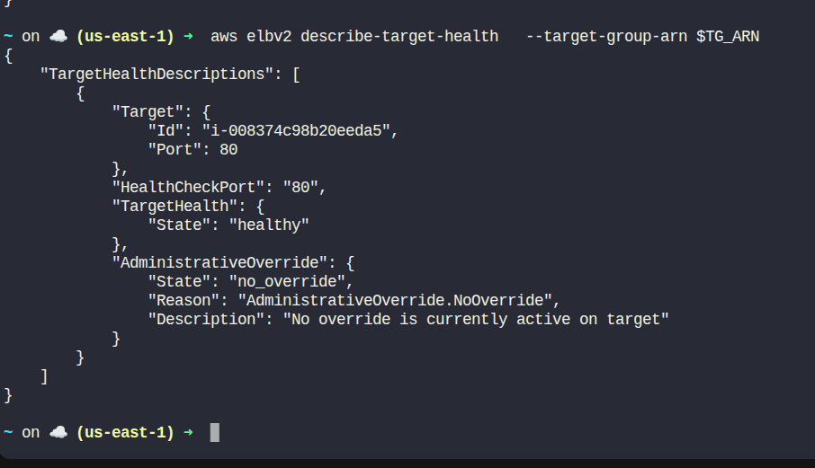
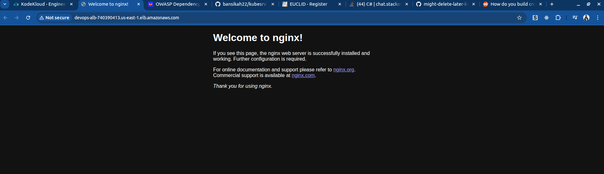

Day 44: Implementing Auto Scaling for High Availability in AWS

>Success doesn't come from what you do occasionally. It comes from what you do consistently.
>
>– Marie Forleo

---

The DevOps team is tasked with setting up a highly available web application using AWS. To achieve this, they plan to use an Auto Scaling Group (ASG) to ensure that the required number of EC2 instances are always running, and an Application Load Balancer (ALB) to distribute traffic across these instances.

The goal of this task is to:

- Set up an ASG that automatically scales EC2 instances based on CPU utilization.
- Set up an ALB that directs incoming traffic to the instances.
- Ensure EC2 instances have Nginx installed and running to serve web traffic.

### Requirements:

- Create an EC2 Launch Template named `devops-launch-template`.
- Use Amazon Linux 2 AMI, t2.micro instance type.
- Configure a security group allowing HTTP (port 80).
- Add User Data to install and start Nginx.
- Create Auto Scaling Group (`devops-asg`) with min=1, desired=1, max=2.
- Target CPU utilization of 50%.
- Create Target Group (`devops-tg`) and ALB (`devops-alb`) listening on port 80.
- Configure ALB health checks.
- Verify ALB DNS shows default Nginx page.
- **Region:** us-east-1

---

## Solution

### Step 1: Set Variables
```sh
# Names
LAUNCH_TEMPLATE="devops-launch-template"
INSTANCE_TYPE="t2.micro"
ASG="devops-asg"
TARGET_GROUP="devops-tg"
ALB="devops-alb"
SG_NAME="web-sg"
```

### Step 2: Get Default VPC, Subnets, and Create Security Group
```sh
# Get default VPC ID
VPC_ID=$(aws ec2 describe-vpcs \
	--filters Name=isDefault,Values=true \
	--query 'Vpcs[0].VpcId' \
	--output text)

# Get 2 subnets for high availability
SUBNETS=$(aws ec2 describe-subnets \
	--filters Name=vpc-id,Values=$VPC_ID \
	--query 'Subnets[0:2].SubnetId' \
	--output text)

# Create Security Group
SG_ID=$(aws ec2 create-security-group \
	--group-name $SG_NAME \
	--description "Allow HTTP traffic" \
	--vpc-id $VPC_ID \
	--query 'GroupId' \
	--output text)

# Allow inbound HTTP traffic
aws ec2 authorize-security-group-ingress \
	--group-id $SG_ID \
	--protocol tcp \
	--port 80 \
	--cidr 0.0.0.0/0
```

### Step 3: Create Launch Template with User Data
```sh
# Create user-data script
cat > userdata.sh <<EOF
#!/bin/bash
yum update -y
amazon-linux-extras install nginx1 -y
systemctl start nginx
systemctl enable nginx
EOF

# Encode User Data
USER_DATA=$(base64 -w 0 userdata.sh)

# Get latest Amazon Linux 2 AMI ID
AMI_ID=$(aws ec2 describe-images \
	--owners amazon \
	--filters "Name=name,Values=amzn2-ami-hvm-*-x86_64-gp2" \
	--query 'Images | sort_by(@,&CreationDate)[-1].ImageId' \
	--output text)

# Create Launch Template
aws ec2 create-launch-template \
	--launch-template-name $LAUNCH_TEMPLATE \
	--launch-template-data "{\
			\"ImageId\": \"$AMI_ID\",\
			\"InstanceType\": \"$INSTANCE_TYPE\",\
			\"SecurityGroupIds\": [\"$SG_ID\"],\
			\"UserData\": \"$USER_DATA\"\
	}"
```

### Step 4: Create Target Group
```sh
TG_ARN=$(aws elbv2 create-target-group \
	--name $TARGET_GROUP \
	--protocol HTTP \
	--port 80 \
	--vpc-id $VPC_ID \
	--health-check-path / \
	--query 'TargetGroups[0].TargetGroupArn' \
	--output text)
```

### Step 5: Create Application Load Balancer
```sh
ALB_ARN=$(aws elbv2 create-load-balancer \
	--name $ALB \
	--subnets $SUBNETS \
	--security-groups $SG_ID \
	--scheme internet-facing \
	--type application \
	--query 'LoadBalancers[0].LoadBalancerArn' \
	--output text)

# Create listener on port 80
aws elbv2 create-listener \
	--load-balancer-arn $ALB_ARN \
	--protocol HTTP \
	--port 80 \
	--default-actions Type=forward,TargetGroupArn=$TG_ARN
```

### Step 6: Create Auto Scaling Group
```sh
aws autoscaling create-auto-scaling-group \
	--auto-scaling-group-name $ASG \
	--launch-template LaunchTemplateName=$LAUNCH_TEMPLATE,Version=1 \
	--min-size 1 \
	--desired-capacity 1 \
	--max-size 2 \
	--vpc-zone-identifier "$(echo $SUBNETS | tr ' ' ',')" \
	--target-group-arns $TG_ARN
```

### Step 7: Configure CPU-based Auto Scaling Policy
```sh
aws autoscaling put-scaling-policy \
	--policy-name cpu-scaling-policy \
	--auto-scaling-group-name $ASG \
	--policy-type TargetTrackingScaling \
	--target-tracking-configuration '{
			"PredefinedMetricSpecification": {
					"PredefinedMetricType": "ASGAverageCPUUtilization"
			},
			"TargetValue": 50.0
	}'
```

### Step 8: Verify Setup
```sh
# Check target health (it may take 3-5 mins to become healthy)
aws elbv2 describe-target-health \
	--target-group-arn $TG_ARN
```
wait until you see 

```
# Get ALB DNS Name
ALB_DNS=$(aws elbv2 describe-load-balancers \
	--load-balancer-arns $ALB_ARN \
	--query 'LoadBalancers[0].DNSName' \
	--output text)

echo "Access your web application at: http://$ALB_DNS"
```
Open the ALB DNS in a browser, and you should see the default Nginx welcome page.


