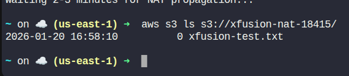

Day 45: Configure NAT Gateway for Internet Access in a Private VPC

>Whatever we believe about ourselves and our ability comes true for us.
>
>– Susan L. Taylor

---

## Day 45 – Corrected Task Description

The Nautilus DevOps team is tasked with enabling internet access for an EC2 instance running in a private subnet. This instance should be able to upload a test file to a public S3 bucket once internet is accessible. To achieve this, the team must set up a NAT Gateway in a public subnet within the same VPC.

**Given:**

- A VPC named xfusion-priv-vpc and a private subnet xfusion-priv-subnet already exist.
- An EC2 instance named xfusion-priv-ec2 is already running in the private subnet.
- The EC2 instance is configured with a cron job that uploads a test file to the bucket xfusion-nat-18415 once internet is available.

**Your task:**

- Create a public subnet xfusion-pub-subnet in the same VPC.
- Create an Internet Gateway and attach it to the VPC.
- Create a route table xfusion-pub-rt and associate it with the public subnet.
- Allocate an Elastic IP and create a NAT Gateway named xfusion-natgw.
- Create a private route table, associate it with the private subnet, and route 0.0.0.0/0 traffic via the NAT Gateway.
- Verify that the EC2 instance can reach the internet by confirming the presence of the test file in the S3 bucket xfusion-nat-18415.

---

## Step-by-Step Solution (Correct)

### Step 1: Set Variables
```sh
VPC_NAME="xfusion-priv-vpc"
PRIVATE_SUBNET_NAME="xfusion-priv-subnet"
PUBLIC_SUBNET_NAME="xfusion-pub-subnet"
PUBLIC_CIDR="10.1.2.0/24"  # choose a valid, non-overlapping CIDR
PRIVATE_RT_NAME="xfusion-priv-rt"
PUBLIC_RT_NAME="xfusion-pub-rt"
NAT_NAME="xfusion-natgw"
REGION="us-east-1"
```

### Step 2: Get VPC and Private Subnet IDs
```sh
VPC_ID=$(aws ec2 describe-vpcs \
	--filters "Name=tag:Name,Values=$VPC_NAME" \
	--query "Vpcs[0].VpcId" --output text)

PRIVATE_SUBNET_ID=$(aws ec2 describe-subnets \
	--filters "Name=tag:Name,Values=$PRIVATE_SUBNET_NAME" \
	--query "Subnets[0].SubnetId" --output text)
```

### Step 3: Create Public Subnet
```sh
PUBLIC_SUBNET_ID=$(aws ec2 create-subnet \
	--vpc-id $VPC_ID \
	--cidr-block $PUBLIC_CIDR \
	--availability-zone ${REGION}a \
	--query "Subnet.SubnetId" --output text)

# Tag the public subnet
aws ec2 create-tags \
	--resources $PUBLIC_SUBNET_ID \
	--tags Key=Name,Value=$PUBLIC_SUBNET_NAME
```

### Step 4: Create and Attach Internet Gateway
```sh
IGW_ID=$(aws ec2 create-internet-gateway \
	--query "InternetGateway.InternetGatewayId" --output text)

aws ec2 attach-internet-gateway \
	--internet-gateway-id $IGW_ID \
	--vpc-id $VPC_ID
```

### Step 5: Create Public Route Table
```sh
# Create public route table
PUBLIC_RT_ID=$(aws ec2 create-route-table \
	--vpc-id $VPC_ID \
	--query "RouteTable.RouteTableId" --output text)

# Tag route table
aws ec2 create-tags \
	--resources $PUBLIC_RT_ID \
	--tags Key=Name,Value=$PUBLIC_RT_NAME

# Associate route table with public subnet
aws ec2 associate-route-table \
	--route-table-id $PUBLIC_RT_ID \
	--subnet-id $PUBLIC_SUBNET_ID

# Route 0.0.0.0/0 via Internet Gateway
aws ec2 create-route \
	--route-table-id $PUBLIC_RT_ID \
	--destination-cidr-block 0.0.0.0/0 \
	--gateway-id $IGW_ID
```

### Step 6: Allocate Elastic IP and Create NAT Gateway
```sh
EIP_ALLOC_ID=$(aws ec2 allocate-address --query "AllocationId" --output text)

NAT_GW_ID=$(aws ec2 create-nat-gateway \
	--subnet-id $PUBLIC_SUBNET_ID \
	--allocation-id $EIP_ALLOC_ID \
	--query "NatGateway.NatGatewayId" --output text)

# Tag NAT Gateway
aws ec2 create-tags \
	--resources $NAT_GW_ID \
	--tags Key=Name,Value=$NAT_NAME

# Wait for NAT Gateway to become available
aws ec2 wait nat-gateway-available --nat-gateway-ids $NAT_GW_ID
```

### Step 7: Create Private Route Table and Associate with Private Subnet

```sh
# Create private route table
PRIVATE_RT_ID=$(aws ec2 create-route-table \
	--vpc-id $VPC_ID \
	--query "RouteTable.RouteTableId" --output text)

# Tag private route table
aws ec2 create-tags \
	--resources $PRIVATE_RT_ID \
	--tags Key=Name,Value=$PRIVATE_RT_NAME

# Associate private route table with private subnet
aws ec2 associate-route-table \
	--route-table-id $PRIVATE_RT_ID \
	--subnet-id $PRIVATE_SUBNET_ID

# Create route via NAT Gateway
aws ec2 create-route \
	--route-table-id $PRIVATE_RT_ID \
	--destination-cidr-block 0.0.0.0/0 \
	--nat-gateway-id $NAT_GW_ID
```

### Step 8: Verify Internet Access
```sh
# Wait 2-3 minutes for NAT propagation
echo "Waiting 2-3 minutes for NAT propagation..."

# Check S3 bucket for test file
aws s3 ls s3://xfusion-nat-18415/
```

You should see something like:

