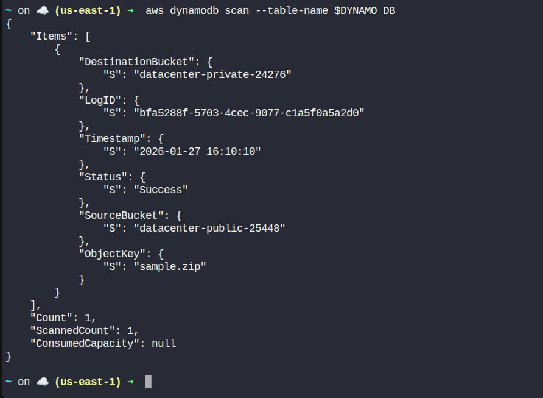

Day 46: Event-Driven Processing with Amazon S3 and Lambda

## Task Description

The DevOps team is working on automating file management between two S3 buckets. The task is to create a public S3 bucket for file uploads and a private S3 bucket for securely storing the files. A Lambda function will be triggered automatically whenever a file is uploaded to the public S3 bucket, which will copy the uploaded file to the private bucket. Additionally, logs of the operation will be stored in a DynamoDB table. The logs should include details such as the source bucket, destination bucket, and the object key of the file that was copied. This will help the team maintain better security and visibility for file transfers.

**Requirements:**

- Create a public S3 bucket named `datacenter-public-25448`. Ensure that the bucket allows public access to its objects.
- Create a private S3 bucket named `datacenter-private-24276`. Ensure that the bucket does not allow public access.
- Create a Lambda function named `datacenter-copyfunction`. This function should be triggered by uploads to the public S3 bucket and should copy the uploaded file to the private bucket. Create the necessary policies and a role named `lambda_execution_role`. Attach these policies to the role, and then link this role to the Lambda function.
- `lambda-function.py` is already present under the `/root/` directory on AWS client host, replace `REPLACE-WITH-YOUR-DYNAMODB-TABLE` and `REPLACE-WITH-YOUR-PRIVATE-BUCKET` values.
- Create a DynamoDB table named `datacenter-S3CopyLogs` with a partition key `LogID` (string).
- For testing upload the file `sample.zip` located in the `/root` directory on the client host to the public S3 bucket.
- Verify that the file has been successfully copied to the private bucket by checking the private bucket in the S3 console.
- Verify that a log entry has been created in the DynamoDB table containing the file copy details.

---

##  Solution 

###  Step 0: Set Variables (DO THIS FIRST)
```bash
PUBLIC_S3="datacenter-public-25448"
PRIVATE_S3="datacenter-private-24276"
LAMBDA="datacenter-copyfunction"
LAMBDA_ROLE="lambda_execution_role"
DYNAMO_DB="datacenter-S3CopyLogs"
PARTITION_KEY="LogID"
REGION="us-east-1"
```

Get your actual lab account ID (never hardcode):
```bash
ACCOUNT_ID=$(aws sts get-caller-identity --query Account --output text)
echo $ACCOUNT_ID
```

###  Step 1: Create Public S3 Bucket (with public access)
```bash
aws s3api create-bucket \
	--bucket $PUBLIC_S3 \
	--region $REGION

aws s3api put-public-access-block \
	--bucket $PUBLIC_S3 \
	--public-access-block-configuration \
	BlockPublicAcls=false,IgnorePublicAcls=false,BlockPublicPolicy=false,RestrictPublicBuckets=false

cat <<EOF > public-policy.json
{
	"Version": "2012-10-17",
	"Statement": [
		{
			"Effect": "Allow",
			"Principal": "*",
			"Action": "s3:GetObject",
			"Resource": "arn:aws:s3:::$PUBLIC_S3/*"
		}
	]
}
EOF

aws s3api put-bucket-policy \
	--bucket $PUBLIC_S3 \
	--policy file://public-policy.json
```

###  Step 2: Create Private S3 Bucket
```bash
aws s3api create-bucket \
	--bucket $PRIVATE_S3 \
	--region $REGION
```

- No public policy here — default private is correct.

###  Step 3: Create DynamoDB Table
```bash
aws dynamodb create-table \
	--table-name $DYNAMO_DB \
	--attribute-definitions AttributeName=$PARTITION_KEY,AttributeType=S \
	--key-schema AttributeName=$PARTITION_KEY,KeyType=HASH \
	--billing-mode PAY_PER_REQUEST \
	--region $REGION

aws dynamodb wait table-exists --table-name $DYNAMO_DB
```

###  Step 4: Create IAM Role for Lambda
Trust policy
```bash
cat <<EOF > trust-policy.json
{
	"Version": "2012-10-17",
	"Statement": [
		{
			"Effect": "Allow",
			"Principal": {
				"Service": "lambda.amazonaws.com"
			},
			"Action": "sts:AssumeRole"
		}
	]
}
EOF

aws iam create-role \
	--role-name $LAMBDA_ROLE \
	--assume-role-policy-document file://trust-policy.json
```

###  Step 5: Create IAM Policy (S3 + DynamoDB + Logs)
```bash
cat <<EOF > lambda-policy.json
{
	"Version": "2012-10-17",
	"Statement": [
		{
			"Effect": "Allow",
			"Action": [
				"logs:CreateLogGroup",
				"logs:CreateLogStream",
				"logs:PutLogEvents"
			],
			"Resource": "*"
		},
		{
			"Effect": "Allow",
			"Action": "s3:GetObject",
			"Resource": "arn:aws:s3:::$PUBLIC_S3/*"
		},
		{
			"Effect": "Allow",
			"Action": "s3:PutObject",
			"Resource": "arn:aws:s3:::$PRIVATE_S3/*"
		},
		{
			"Effect": "Allow",
			"Action": "dynamodb:PutItem",
			"Resource": "arn:aws:dynamodb:$REGION:$ACCOUNT_ID:table/$DYNAMO_DB"
		}
	]
}
EOF

aws iam create-policy \
	--policy-name lambda_s3_dynamo_policy \
	--policy-document file://lambda-policy.json

aws iam attach-role-policy \
	--role-name $LAMBDA_ROLE \
	--policy-arn arn:aws:iam::$ACCOUNT_ID:policy/lambda_s3_dynamo_policy

aws iam attach-role-policy \
	--role-name $LAMBDA_ROLE \
	--policy-arn arn:aws:iam::aws:policy/service-role/AWSLambdaBasicExecutionRole
```

- Wait 30 seconds (IAM propagation is real).

###  Step 6: Prepare Lambda Code
Edit the file:
```bash
vi /root/lambda-function.py
```
Replace:
- `REPLACE-WITH-YOUR-DYNAMODB-TABLE` → `datacenter-S3CopyLogs`
- `REPLACE-WITH-YOUR-PRIVATE-BUCKET` → `datacenter-private-24276`

Zip it:
```bash
cd /root
zip lambda-function.zip lambda-function.py
```

###  Step 7: Create Lambda Function
```bash
aws lambda create-function \
	--function-name $LAMBDA \
	--runtime python3.9 \
	--role arn:aws:iam::$ACCOUNT_ID:role/$LAMBDA_ROLE \
	--handler lambda-function.lambda_handler \
	--zip-file fileb://lambda-function.zip \
	--region $REGION
```

###  Step 8: Allow S3 to Invoke Lambda (CRITICAL)
```bash
aws lambda add-permission \
	--function-name $LAMBDA \
	--statement-id s3invoke \
	--action lambda:InvokeFunction \
	--principal s3.amazonaws.com \
	--source-arn arn:aws:s3:::$PUBLIC_S3
```

###  Step 9: Configure S3 Event Notification
```bash
cat <<EOF > notification.json
{
	"LambdaFunctionConfigurations": [
		{
			"LambdaFunctionArn": "arn:aws:lambda:$REGION:$ACCOUNT_ID:function:$LAMBDA",
			"Events": ["s3:ObjectCreated:*"]
		}
	]
}
EOF

aws s3api put-bucket-notification-configuration \
	--bucket $PUBLIC_S3 \
	--notification-configuration file://notification.json
```

###  Step 10: Testing & Verification
Upload test file
```bash
aws s3 cp /root/sample.zip s3://$PUBLIC_S3/
```

Verify private bucket
```bash
aws s3 ls s3://$PRIVATE_S3/
```

Verify DynamoDB logs
```bash
aws dynamodb scan --table-name $DYNAMO_DB
```


